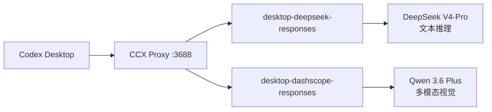
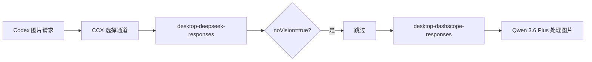

# CodeX使用CCX 接入 DeepSeek + DashScope 多模型配置指南

## CCX 下载与安装

### 下载

从 [GitHub Releases](https://github.com/BenedictKing/ccx/releases) 获取最新版本。

macOS Apple Silicon（M 系列芯片）选择 `CCX-Desktop-<版本>-darwin-arm64.dmg`，Intel Mac 选择 `CCX-Desktop-<版本>-darwin-amd64.dmg`。

### 安装

1. 打开 `.dmg` 文件，将 CCX 拖入 `Applications` 文件夹
2. 首次启动时，macOS 会提示"无法验证开发者"：前往 **系统设置 → 隐私与安全性**，点击"仍要打开"
3. 启动后 CCX 图标出现在菜单栏托盘中

### 升级

覆盖安装新版 `.dmg` 即可，配置文件会保留。也可以等 CCX 自动检测更新后点击升级。

## 配置文件说明

### 配置文件路径

```Bash
~/Library/Application Support/ccx-desktop/.config/config.json
```

### 代理密钥

CCX 代理密钥需要在两个位置配置：

1. **`.env` 文件**：`~/Library/Application Support/ccx-desktop/.env`

   ```Bash
   PROXY_KEY=ccx-xxxx***xxxx
   ```
2. **Codex auth.json**：`~/.codex/auth.json`

   ```json
   {
     "api_key": "ccx-xxxx***xxxx",
     "base_url": "http://localhost:3688/v1"
   }
   ```

### 两大配置区域

`config.json` 中与 Codex 相关的配置主要有两个数组：

| 配置区域 | 用途 | 说明 |
|-|-|-|
| `upstream` | 聊天渠道 | Codex Chat 界面使用的模型通道 |
| `responsesUpstream` | Responses 渠道 | Codex Agent 模式使用的模型通道（主战场） |

**日常使用 Codex Agent 模式时，起作用的都是 `responsesUpstream` 中的通道配置。**

### 通道参数速查

| 参数 | 类型 | 说明 |
|-|-|-|
| `baseUrl` | string | 上游 API 地址，必须包含 `/v1` |
| `apiKeys` | array | API Key 列表，支持多 Key 负载均衡 |
| `serviceType` | string | `"openai"` 走 Chat Completions（推荐），`"responses"` 仅限支持 Responses API 的服务 |
| `modelMapping` | object | Codex 内部模型名 → 上游模型名的映射 |
| `reasoningMapping` | object | 思考强度映射，如 `{"gpt": "max"}` |
| `reasoningParamStyle` | string | 思考参数风格，DeepSeek/Qwen 用 `"reasoning"` |
| `noVision` | bool | 设为 `true` 声明此通道不支持图片，视觉请求自动跳过 |
| `codexNativeToolPassthrough` | bool | 透传 Codex 原生工具调用 |
| `priority` | int | 优先级，数字越小越优先 |
| `status` | string | `"active"` 启用，`"inactive"` 停用 |
| `autoBlacklistBalance` | bool | 自动熔断与恢复 |

### 对应 Codex Config

Codex 的 `~/.codex/config.toml` 中需确保：

```toml
[model_providers.OpenAI]
base_url = "http://localhost:3688/v1"
wire_api = "responses"

[features]
js_repl = true
```

### 修改配置后

1. 编辑 `config.json` 保存
2. 右键托盘图标 → 退出，重新启动 CCX
3. 查看日志 `~/Library/Application Support/ccx-desktop/logs/app.log` 确认通道正常

## 通道管理界面

CCX 托盘菜单提供图形化的通道管理：

- **Channel Logs**：实时查看每个通道的请求日志、耗时、失败率
- **Channel Config**：在 UI 中增删改通道配置（底层仍写入 `config.json`）
- **Scheduler**：查看通道优先级和熔断状态

遇到 "所有渠道都失败了" 或某个通道 100% 失败率时，先检查 Channel Logs 中的具体错误信息，常见原因：

- `baseUrl` 缺少 `/v1`
- `serviceType` 类型不匹配
- 模型名在目标平台不存在
- API Key 过期或权限不足

## 架构概览

Codex → CCX Proxy → 上游模型（DeepSeek / DashScope）

CCX 通过 `responsesUpstream` 通道配置将 Codex 的 Responses API 请求转译为上游兼容格式。当前配置了两个通道：



## 通道一：DeepSeek（文本推理）

```json
{
  "baseUrl": "https://api.deepseek.com",
  "apiKeys": ["sk-5a02***2471"],
  "serviceType": "openai",
  "name": "desktop-deepseek-responses",
  "modelMapping": {
    "gpt": "deepseek-v4-pro",
    "mini": "deepseek-v4-flash"
  },
  "reasoningMapping": {
    "gpt": "max"
  },
  "reasoningParamStyle": "reasoning",
  "codexNativeToolPassthrough": true,
  "noVision": true,
  "priority": 1,
  "status": "active",
  "autoBlacklistBalance": true
}
```

关键参数说明：

- **serviceType: "openai"** — 使用标准 Chat Completions API，CCX 自动完成 Responses → Chat 转译
- **noVision: true** — 声明此通道不支持图片，包含图片的请求自动跳过此通道
- **reasoningMapping** — `gpt` 映射到 `max`，使用 `reasoning` 参数风格
- **codexNativeToolPassthrough: true** — 透传 Codex 原生工具调用

## 通道二：DashScope / 千问（多模态视觉）

```json
{
  "baseUrl": "https://dashscope.aliyuncs.com/compatible-mode/v1",
  "apiKeys": ["sk-ec4f***f4cb"],
  "serviceType": "openai",
  "name": "desktop-dashscope-responses",
  "modelMapping": {
    "gpt": "qwen3.6-plus",
    "mini": "qwen3.6-plus"
  },
  "reasoningParamStyle": "reasoning",
  "codexNativeToolPassthrough": true,
  "codexToolCompat": true,
  "stripCodexClientTools": true,
  "priority": 1,
  "status": "active",
  "autoBlacklistBalance": true
}
```

关键参数说明：

- **无 `noVision` 标志** — 此通道支持图片输入。当 DeepSeek 通道因 `noVision: true` 跳过视觉请求时，自动降级到此通道处理
- **`codexToolCompat: true`** — 启用工具兼容模式，将 Codex 原生工具调用转译为上游支持的格式
- **`stripCodexClientTools: true`** — 剥离 Codex 客户端工具（如 browser、computer-use 等），避免上游模型收到无法处理的工具定义

## 踩坑记录：三个致命配置错误

### 1. baseUrl 缺少 `/v1`

错误：`https://dashscope.aliyuncs.com/compatible-mode`

正确：`https://dashscope.aliyuncs.com/compatible-mode/v1`

缺少 `/v1` 导致 CCX 拼接出的实际请求 URL 不正确，DashScope 返回空流响应。

### 2. serviceType 错误使用 "responses"

错误：`"serviceType": "responses"`

正确：`"serviceType": "openai"`

DashScope 不支持 OpenAI 的 Responses API（`/v1/responses`），必须使用 `openai` 类型让 CCX 转换为标准 Chat Completions 格式。

### 3. 模型名错误

错误：`"gpt": "qwen3.5-plus"`

正确：`"gpt": "qwen3.6-plus"`

百炼平台上不存在 `qwen3.5-plus` 模型，正确名称为 `qwen3.6-plus`。可从[百炼模型广场](https://bailian.console.aliyun.com)确认可用模型名。

## 快速排障

| 现象 | 可能原因 | 检查方法 |
|-|-|-|
| 所有渠道都失败 | `baseUrl` 缺 `/v1` 或 `serviceType` 不匹配 | Channel Logs 看实际请求 URL |
| 视觉请求没走 Qwen | dashscope 通道被熔断或 `status` 非 active | 检查 Scheduler 通道状态 |
| 首次响应慢 | CCX 按优先级轮询通道，高优先级通道超时 | 确认高优先级通道配置正确 |
| 403 / access_denied | API Key 过期或 IP 白名单限制 | curl 直连上游 API 验证 |
| upstream returned empty stream | 上游返回空响应 | 通常是 `baseUrl` 缺失 `/v1`，检查实际请求 URL |
| 100% 失败率后通道不可用 | 自动熔断触发 | 重启 CCX 清除熔断状态 |

## 视觉路由机制

当 Codex 发送包含图片的请求时：



1. CCX 按优先级选择通道
2. DeepSeek 通道检测到图片 → `noVision: true` → 自动跳过
3. 降级到 DashScope 通道 → Qwen 3.6 Plus 处理视觉请求
4. 图片以 base64 内嵌传输，不受 DashScope API Key IP 白名单影响

## API Key 注意事项

### DeepSeek

- 直接使用 DeepSeek 官方 API Key
- Context 长度：1M tokens
- 无视觉能力

### DashScope（阿里云百炼）

- API Key 可在[百炼控制台](https://bailian.console.aliyun.com)管理
- 需开通 `qwen3.6-plus` 模型权限
- 如果设置了 IP 白名单，需确保 CCX 所在机器 IP 在名单内
- 代码中发送图片均以 base64 格式内嵌，不会触发外部 URL 抓取的 IP 限制
- Qwen 3.6 Plus 支持文本生成和视觉理解

## 验证方法

### 文本请求（DeepSeek 通道）

查看 CCX 日志确认请求走了 DeepSeek：

```
选择渠道: [0] desktop-deepseek-responses
实际请求URL: https://api.deepseek.com/v1/chat/completions
```

### 图片请求（DashScope 通道）

发送包含图片的请求，日志应显示：

```
跳过不支持视觉的渠道 [0] desktop-deepseek-responses
选择渠道: [1] desktop-dashscope-responses
实际请求URL: https://dashscope.aliyuncs.com/compatible-mode/v1/chat/completions
```

### 直接 API 测试

```bash
curl -X POST "https://dashscope.aliyuncs.com/compatible-mode/v1/chat/completions" \
  -H "Authorization: Bearer <API_KEY>" \
  -H "Content-Type: application/json" \
  -d '{"model":"qwen3.6-plus","messages":[{"role":"user","content":"say hi"}],"max_tokens":10,"stream":false}'
```
