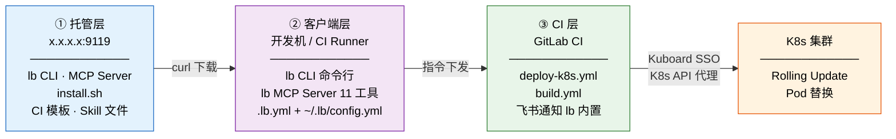
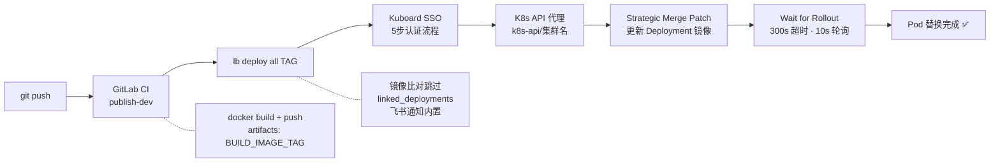

#  DevOps 工具集 (lb v2.0.0) — K8s 自动部署方案

> **日期**: 2026-06-24

> **来源**: 多项目经验沉淀，经多轮迭代与多项目验证

> **适用范围**: 任何使用 Kuboard 管理 K8s 的 GitLab CI 项目

---

## 一、架构总览

### 1.1 三层架构



### 1.2 部署流程



---

## 二、快速接入（1 分钟）

**前置**: 你有 GitLab 账号和 Kuboard 登录权限。

### Step 1: 安装 lb

```Bash
curl -fsSL http://x.x.x.x:9119/install.sh | bash
```

此命令会自动：下载 lb CLI + MCP Server → 配置 AI 平台 Skill → 创建 \~/.lb/config.yml 模板。

### Step 2: 配置认证

```Bash
cat > ~/.lb/config.yml <<YAML
gitlab_token: "glpat-xxx"
kuboard_username: "your-kuboard-username"
kuboard_password: "your-kuboard-password"
YAML
# 或用环境变量:
# export GITLAB_TOKEN=glpat-xxx
# export KUBOARD_USERNAME=yourname
# export KUBOARD_PASSWORD=yourpassword
```

**GitLab Token 获取**: [https://code.example.devops.com/-/profile/personal_access_tokens](https://code.example.devops.com/-/profile/personal_access_tokens)（scope: `read_api`）

**Kuboard 账号**: 联系管理员开通（注意：Kuboard 密码 ≠ GitLab 密码）

### Step 3: 项目接入

```Bash
cd your-project
lb setup          # 交互式生成 .lb.yml + 复制 CI 模板
lb check          # 验证配置 + 连通性
```

### Step 4: 验证

```Bash
git push  # 自动触发 CI 构建 → 部署 → 飞书通知 ✅
```

---

## 三、核心命令

### 3.1 部署

```Bash
lb deploy <目标> [tag]           # 部署指定目标, tag 为空则自动从 CI 获取最新成功构建
lb deploy <目标1> <目标2> [tag]  # 同时部署多个目标
lb deploy all [tag]              # 部署所有目标（多容器并行）
```

`lb deploy` 的核心逻辑：

1. Kuboard SSO 登录（5步流程，Go 内实现）
2. Tag 为空 → 调用 GitLab API 获取最新成功 pipeline 的 commit SHA（取前 8 位）
3. 多目标并行部署（goroutine + WaitGroup）
4. 每个目标：获取当前镜像 → 比对 → 相同则跳过 / 不同则 PATCH
5. 更新关联 Deployment（linked_deployments，同一镜像不同环境变量）
6. 等待滚动更新完成（300s 超时，10s 轮询）
7. 部署完成 → 飞书通知（Interactive Card，展示镜像/分支/部署者/目标列表）

### 3.2 K8s 状态 & 当前版本

```Bash
lb status          # 所有目标的 Deployment + Pod 状态
lb current         # 当前运行的镜像版本（含主容器 + 关联 Deployment）
```

### 3.3 K8s 日志

```Bash
lb logs <目标> [关键词]   # 查询指定目标的 Pod 日志，支持关键词过滤
```

### 3.4 CI 排障

```Bash
lb ci-status [分支]       # 当前分支 GitLab CI 流水线状态 + Job 列表
lb ci-logs <job-id>       # 读取指定 Job 日志（最后 80 行）
lb ci-logs --failed       # 读取最新失败 pipeline 中所有失败 Job 日志
lb ci-logs --job <名称>   # 按 Job 名读取日志（如 lb ci-logs --job publish-dev）
```

### 3.5 智能诊断（容器感知）

```Bash
lb diagnose [目标|all]    # 一键诊断（排障首选!）
```

`lb diagnose` 自动执行：

1. **CI 阶段**: 查看当前分支 GitLab CI pipeline 状态，列出失败的 Job
2. **K8s 阶段**:

   - Deployment rollout status（ready/updated/available/desired）
   - Pod 列表 + 每个容器的 readiness
   - K8s Events（最近 5 条）
   - 每个容器最近 50 行日志中匹配 error/warn/panic 的行
3. **容器感知**: 自动发现主容器 + linked deployment 容器，逐个诊断

### 3.6 项目管理

```Bash
lb setup            # 交互式生成 .lb.yml（配置向导）+ 复制 CI 模板
lb check            # 验证配置完整性 + GitLab API 连通性 + Kuboard 凭证
lb version          # 显示版本号
```

---

## 四、配置体系

### 4.1 双层配置

| 层级 | 文件 | 内容 |
|-|-|-|
| 项目级 | `.lb.yml`（项目根目录） | Kuboard/集群、GitLab项目、镜像仓库、部署目标 |
| 用户级 | `~/.lb/config.yml` | GitLab Token、Kuboard 账号密码、飞书 Webhook（可选） |

### 4.2 环境变量覆盖（优先级最高）

| 环境变量 | 覆盖字段 | 说明 |
|-|-|-|
| `GITLAB_TOKEN` | UserConfig.GitlabToken | GitLab Personal Access Token |
| `KUBOARD_USERNAME` | UserConfig.KuboardUsername | Kuboard 登录用户名 |
| `KUBOARD_PASSWORD` | UserConfig.KuboardPassword | Kuboard 登录密码 |
| `FEISHU_WEBHOOK` | NotifyConfig.FeishuWebhook | 飞书通知 Webhook（可选） |

### 4.3 .lb.yml 配置详解

```YAML
kuboard:
  base_url: "http://k8s.example.devops.com"    # Kuboard 地址
  cluster: "JXQ"                               # K8s 集群名（URL中可见）

gitlab:
  host: "code.example.devops.com"               # GitLab 域名
  project_path: "saas/backend/project-a"             # 项目路径

image:
  registry: "registry.example.devops.com:31911" # 镜像仓库地址
  repo: "backend/project-a-svc-dev"                  # 镜像仓库路径

notify:                       # 飞书通知（可选）
  feishu_webhook: ""          # Webhook URL，空则用默认

targets:                      # 部署目标列表
  - name: backend             # 目标名称
    namespace: backend        # K8s namespace
    deployment: project-a-pub      # Deployment 名称
    containers:               # 主容器列表（更新第一个容器镜像）
      - project-a-pub

  - name: script              # 带关联部署的目标
    namespace: script
    deployment: project-a-svc
    containers:
      - project-a-svc-asr
    linked_deployments:       # 关联 Deployment（同一镜像，不同环境变量）
      - name: project-a-svc-nlp
        container: project-a-svc-nlp
      - name: project-a-svc-post
        container: project-a-svc-post
      - name: project-a-svc-summary
        container: project-a-svc-summary
```

### 4.4 飞书通知优先级

```
环境变量 FEISHU_WEBHOOK > 用户配置 ~/.lb/config.yml > 项目配置 .lb.yml > 无通知
```

仅在显式配置 webhook 时才推送飞书通知。通知为 **Interactive Card** 格式，包含：

- 彩色 header（绿/红）
- 镜像 / Tag / 分支 / 部署者 / 目标列表
- 成功/失败状态行
- 错误详情（如有失败）

---

## 五、部署架构详解

### 5.1 linked_deployments — 关联部署

解决"一个镜像部署多个 K8s Deployment（不同环境变量）"的场景。

```
lb deploy script a671017a
  → 主 Deployment: script/project-a-svc (容器 project-a-svc-asr)
    ├── 更新镜像 ✅
    └── 等待滚动更新...
  → 关联 Deployment: script/project-a-svc-nlp (容器 project-a-svc-nlp)
    ├── 更新镜像 ✅
    └── 等待滚动更新...
  → 关联 Deployment: script/project-a-svc-post (容器 project-a-svc-post)
    ├── 更新镜像 ✅
    └── 等待滚动更新...
  → 关联 Deployment: script/project-a-svc-summary (容器 project-a-svc-summary)
    ├── 更新镜像 ✅
    └── 等待滚动更新...
```

### 5.2 镜像比对跳过

部署时自动比对当前镜像和目标镜像，相同时跳过：

```
当前镜像: registry.example.devops.com:31911/backend/project-a-svc-dev:a671017a
目标镜像: registry.example.devops.com:31911/backend/project-a-svc-dev:a671017a
⚠️  镜像未变更，跳过部署
```

### 5.3 自动获取 CI tag

`lb deploy script`（不指定 tag）时自动调用 GitLab API 获取最新成功 pipeline 的 commit SHA 前 8 位作为 tag：

```
正在获取 GitLab CI 最新构建 tag ... a671017a
目标镜像: registry.example.devops.com:31911/backend/project-a-svc-dev:a671017a
```

如果最新 pipeline 状态不是 success，则报错提示手动指定 tag。

---

## 六、CI 集成模板

### 6.1 deploy-k8s.yml — K8s 自动部署

`lb setup` 自动将模板复制到项目 `ci/` 目录。模板包含两个 job：

- **`build-deploy-image`**: 一次性构建部署加速镜像（alpine:3.20 + curl + jq），仅 Dockerfile-deploy 变更时触发
- **`deploy-k8s`**: 实际部署 job，从托管服务器下载最新 lb 二进制后执行 `lb deploy all`

核心 deploy-k8s 逻辑：

```YAML
# ci/deploy-k8s.yml（关键片段）

deploy-k8s:
  stage: deploy
  image: ${HARBOR_HOST}/base/alpine-curl-jq:3.20
  needs:
    - job: publish-dev
      artifacts: true
  rules:
    - if: '$GITLAB_USER_LOGIN == "wangbin"'  # 仅指定用户自动触发
      when: on_success
    - when: manual                            # 其他用户手动触发
  script:
    - curl -fsSL -o /usr/local/bin/lb http://x.x.x.x:9119/lb-linux
    - chmod +x /usr/local/bin/lb
    - lb deploy all "$TAG"                    # lb 内置飞书通知
  environment:
    name: dev
    action: start
```

### 6.2 build.yml — Docker 构建

```YAML
# ci/build.yml（关键片段）

publish-dev:
  stage: publish
  image: docker:20.10.7
  variables:
    APP_NAME: your-app
    APP_TYPE: backend
    ENV: dev
    TAG_COMMIT: $HARBOR_HOST/$APP_TYPE/$APP_NAME-$ENV:latest
    TAG_LATEST: $HARBOR_HOST/$APP_TYPE/$APP_NAME-$ENV:$CI_COMMIT_SHORT_SHA
  script:
    - docker build -t $TAG_COMMIT -t $TAG_LATEST .
    - docker push $TAG_COMMIT && docker push $TAG_LATEST
    - echo "BUILD_IMAGE_TAG=${TAG_LATEST}" >> build.env
  artifacts:
    reports:
      dotenv: build.env
```

### 6.3 Dockerfile-deploy — CI 加速镜像

```Dockerfile
FROM alpine:3.20
RUN apk add --no-cache curl jq
```

注：`lb deploy all` 在 CI 中运行，不需要在加速镜像中预装 lb（从托管服务器动态下载）。

### 6.4 主 CI 引入

```YAML
# .gitlab-ci.yml

include:
  - local: 'ci/build.yml'
  - local: 'ci/deploy-k8s.yml'

variables:
  APP_NAME: your-app
  APP_TYPE: backend
```

### 6.5 飞书通知（lb 内置）

`lb deploy` 执行完成自动发送飞书 Interactive Card。通知示例：

```
🟢 部署成功 — project-a
镜像: registry.example.devops.com:31911/backend/project-a-svc-dev:a671017a
Tag: a671017a
分支: master
部署者: wangbin
目标: backend, script
✅ 全部部署完成
```

---

## 七、MCP Server — AI 辅助 DevOps

### 7.1 概述

lb-mcp-server 是本地 stdio 模式的 MCP Server，**每人用自己的账号**运行，不共享凭证。

```
AI Assistant (OpenCode/Claude Code/Gemini CLI)
    │
    │ MCP Protocol (stdio)
    │
┌───▼─────────────┐
│ lb-mcp-server   │ v2.0.0
│ 11 MCP Tools     │
├─────────────────┤
│ KUBOARD_BASE_URL │ ← 环境变量（可省略，默认 http://k8s.example.devops.com）
│ KUBOARD_USERNAME │    （个人账号）
│ KUBOARD_PASSWORD │
│ GITLAB_TOKEN     │
│ K8S_CLUSTER      │
│ FEISHU_WEBHOOK   │
└─────────────────┘
```

### 7.2 11 个 MCP 工具

| 工具名 | 类别 | 描述 |
|-|-|-|
| `k8s_list_pods` | K8s | 列出 Deployment 的 Pod 状态 |
| `k8s_get_logs` | K8s | 获取 Pod 容器日志 |
| `k8s_get_deployment_status` | K8s | 获取 Deployment rollout 状态 |
| `k8s_get_events` | K8s | 获取 Deployment 最近 Events |
| `k8s_diagnose` | K8s | **一键诊断**：Status + Pods + Error Logs + Events |
| `k8s_get_ingress` | K8s | 获取 Ingress 配置（含 TLS 和注解） |
| `k8s_patch_ingress_tls` | K8s | 配置 Ingress TLS 协议（如启用 TLSv1.3） |
| `k8s_restart_deployment` | K8s | 重启 Deployment（触发滚动重启，用于强制重载 Nginx Ingress TLS 配置） |
| `gitlab_get_pipeline` | GitLab | 获取最新 Pipeline 状态 + Job 列表 |
| `gitlab_get_job_logs` | GitLab | 获取 CI Job 日志（返回最后 100 行） |
| `send_feishu_notification` | 通知 | 发送飞书 Interactive Card 通知 |

### 7.3 自然语言交互示例

```
用户: " 的 backend 部署状态怎么样？"
AI → k8s_get_deployment_status(namespace="backend", deployment="project-a-pub")

用户: "SKB 最新的 CI 失败原因是什么？"
AI → gitlab_get_pipeline(project_path="saas/backend/project-b") → gitlab_get_job_logs(job_id)

用户: "诊断下 script 目标"
AI → k8s_diagnose(namespace="script", deployment="project-a-svc")
```

---

## 八、AI Skill 集成

lb 提供 OpenCode Skill（`~/.config/opencode/skills/lb-devops/SKILL.md`），安装后 AI 自动识别 DevOps 相关请求。

**Skill 触发条件**:

- 部署、发布、上线 → 推荐走 CI
- 查 K8s 日志、Pod 状态、容器状态
- 查 GitLab CI/CD 流水线状态或日志
- 排查部署问题、诊断故障 → 优先使用 `lb diagnose`

**排障工作流**:

```
用户说"部署失败了"
  → lb diagnose <目标>          ← 第一步
    ├── CI 流水线状态? 失败 → lb ci-logs --failed
    ├── K8s Pod 状态?   异常 → lb logs <目标> "Error"
    ├── 容器日志?       error/panic → 定位代码问题
    └── K8s Events?     OOM/Probe → 资源配置问题
```

---

## 九、Kubernetes 底层原理

### 9.1 K8s API 代理

Kuboard 内置 **K8s API 代理**，不需要 kubeconfig：

```Plain
http://k8s.example.devops.com/k8s-api/{集群名}/apis/apps/v1/namespaces/{ns}/deployments/{name}
```

- 用 Kuboard session cookie（KuboardToken）即可认证
- 支持完整的 K8s REST API (GET/PATCH/DELETE)
- 入口路径: `/k8s-api/`

### 9.2 SSO 认证流程（5 步）

Kuboard 使用 OIDC SSO（Dex 作为 provider），loginType 为 `default`。

```Plain
Step 1: GET /sso/auth (302 → /sso/auth/default?req=XXX)
Step 2: POST /login/password (验证用户名密码)
Step 3: POST /sso/auth/default?req=XXX (提交 SSO 表单, password 是 JSON URL-encoded)
Step 4: GET /sso/approval?req=XXX (302 → /callback?code=YYY)
Step 5: GET /callback?code=YYY (Set-Cookie: KuboardToken=<JWT>)
```

> lb CLI 和 MCP Server 均在 Go 中内置了此 5 步认证流程，用户无需手动处理。

### 9.3 更新 Deployment 镜像

使用 **strategic-merge-patch+json** 方式只更新容器镜像：

```JSON
{
  "spec": {
    "template": {
      "spec": {
        "containers": [
          {
            "name": "CONTAINER_NAME",
            "image": "NEW_IMAGE:TAG"
          }
        ]
      }
    }
  }
}
```

### 9.4 滚动更新状态检查

轮询 deployment status，直到所有副本就绪：

```
Updated == Desired && Ready == Desired && Available == Desired
```

---

## 十、踩坑记录

| 坑 | 症状 | 根因 | 解决 |
|-|-|-|-|
| Kuboard SSO 密码 ≠ GitLab 密码 | 401/403 认证失败 | 两个平台密码不同 | 确认使用 Kuboard 密码 |
| 容器名 ≠ Deployment 名 | PATCH 成功但镜像未更新 | 容器名为 `project-a-svc-asr` | 配置中使用实际容器名 |
| SSO 重定向返回相对 URL | curl: URL malformat | `/sso/...` 缺 base URL | Go 内自动补全完整 URL |
| password 字段是 JSON 不是原始密码 | wrong password | SSO 表单格式特殊 | Go 内自动 JSON Marshal + URL Encode |
| 最新 pipeline 状态非 success | `lb deploy` 无法自动获取 tag | CI 构建失败或无 pipeline | 手动指定 tag: `lb deploy backend abc12345` |
| linked_deployments 需要单独配置容器名 | 关联部署未更新 | 容器名未配置 | 在 .lb.yml 中配置 linked_deployments.container |
| curlimages/curl 非 root 用户 | Permission denied (apk) | 容器安全策略 | 用 `alpine:3.20` (root) 或定制镜像 |

---

## 十一、部署与运维

### 11.1 托管服务器

```
地址:   x.x.x.x:9119
目录:   /opt/devops-tools/tools
进程:   python3 -m http.server 9119 --directory /opt/devops-tools/tools
用户:   root
访问:   SSH key (ssh-copy-id root@x.x.x.x)
```

### 11.2 文件清单

| 文件 | 用途 |
|-|-|
| `lb-linux` | lb CLI → Linux |
| `lb-darwin-arm64` | lb CLI → macOS ARM |
| `lb-darwin-x86_64` | lb CLI → macOS x86 |
| `lb-mcp-server-linux` | MCP Server → Linux |
| `lb-mcp-server-darwin-arm64` | MCP Server → macOS ARM |
| `lb-mcp-server-darwin-x86_64` | MCP Server → macOS x86 |
| `install.sh` | 一键安装/更新脚本 |
| `SKILL.md` | AI Skill 文件 |
| `deploy-k8s.yml` | K8s 自动部署 CI 模板 |
| `build.yml` | Docker 构建 CI 模板 |
| `Dockerfile-deploy` | CI 加速镜像 |

### 11.3 部署到托管服务器

```Bash
cd ~/devops-tools

# 全量部署
./deploy-server.sh

# 仅 lb CLI
./deploy-server.sh --lb

# 仅 MCP Server
./deploy-server.sh --mcp

# 预览模式（不实际上传）
./deploy-server.sh --dry-run
```

特性：MD5 比对（远程文件未变化则跳过上传）、自动 chmod 755

### 11.4 编译方法

```Bash
# lb CLI — macOS ARM
cd ~/devops-tools/lb && go build -o lb-darwin-arm64 .

# lb CLI — macOS x86
GOOS=darwin GOARCH=amd64 go build -o lb-darwin-amd64 .

# lb CLI — Linux（Docker 内编译，因为有 CGO 相关依赖）
docker run --rm -v $PWD:/src golang:1.25 sh -c "cd /src && GOOS=linux go build -o lb-linux ."

# MCP Server — 同样三平台
cd ~/devops-tools/lb-mcp-server
go build -o mcp-darwin-arm64 .
GOOS=darwin GOARCH=amd64 go build -o mcp-darwin-amd64 .
docker run --rm -v $PWD:/src golang:1.25 sh -c "cd /src && GOOS=linux go build -o lb-mcp-server-linux ."
```

### 11.5 源码位置

- lb CLI 源码: `~/devops-tools/lb/`（Go，单文件 main package）
- MCP Server 源码: `~/devops-tools/lb-mcp-server/`（Go，mcp-go 生态）
- CI 模板: `~/devops-tools/ci-templates/`
- 部署脚本: `~/devops-tools/deploy-server.sh`

---

## 十二、与原始方案对比

| 项目 | 原始方案（手动 Shell 脚本） | lb v2.0.0 |
|-|-|-|
| 接入时间 | \~15 分钟（复制文件 + 改 9 项配置） | \~1 分钟（lb setup） |
| 多项目支持 | 每个项目独立复制修改 | 每项目一个 .lb.yml |
| 多容器并行部署 | 不支持 | goroutine + linked_deployments |
| 容器感知诊断 | ❌ 手动查多处 | `lb diagnose` 一键诊断 |
| CI 日志读取 | ❌ 需要打开浏览器 | `lb ci-logs --failed` |
| 凭证安全 | 密码硬编码在脚本中 | 环境变量 + \~/.lb/config.yml |
| 分发方式 | 拷贝多个文件 | 单二进制 + install.sh |
| 飞书通知 | ❌ 无 | lb 内置 Interactive Card |
| AI 集成 | ❌ 无 | MCP Server + OpenCode Skill |
| 当前镜像查看 | ❌ 无 | `lb current` |
